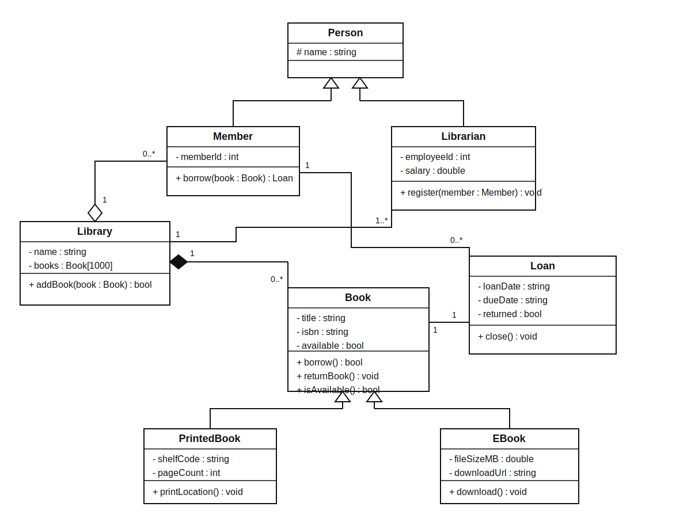

# Solutions – Section III: UML Review – Library Management System

---

## Task Part 1 – Understand the Diagram

### 1. Modeled Classes

The diagram contains the following classes:

- `Library`
- `Book`
- `PrintedBook`
- `EBook`
- `Member`
- `Librarian`
- `Loan`

---

### 2. Visible Attributes and Methods

All elements marked with `+` are publicly accessible.

**Book**
- `+ title : string`
- `+ isbn : string`
- `+ available : bool`
- `+ borrow() : void`

**Librarian**
- `+ salary : double`
- `+ register(m : Member) : void`

**Library**
- `+ addBook(b : Book) : bool`

**Member**
- `+ borrow(b : Book) : void`

**PrintedBook**
- `+ printLocation() : void`

**EBook**
- `+ download() : void`

**Loan**
- `+ close() : void`

---

### 3. Inheritance Relationships

- `PrintedBook` inherits from `Book`
- `EBook` inherits from `Book`
- `Librarian` inherits from `Member`

The first two are reasonable, the last one is questionable.

---

### 4. Class Relationships

- `Library` — `Book`: composition  
- `Library` — `Member`: aggregation  
- `Library` — `Librarian`: association  
- `Member` — `Loan`: association  
- `Loan` — `Book`: composition (problematic)

---

## Task Part 2 – Evaluate the Design

### 1. Correctly Modeled Relationships

- `PrintedBook` and `EBook` as subtypes of `Book`  
  → correct "is-a" relationship

- `Library` to `Member` as aggregation  
  → members exist independently

- `Library` to `Librarian` as association  
  → reasonable loose coupling

- `Member` to `Loan` as association  
  → members can have multiple loans

---

### 2. Problematic Design Choices

- `Loan` owns `Book` (composition)  
  → incorrect, a loan should only reference a book

- `Librarian` inherits from `Member`  
  → conceptually wrong, different roles

- Public attributes in `Book`  
  → violates encapsulation

- Public `salary` in `Librarian`  
  → sensitive data should be private

---

### 3. Evaluation of Inheritance

Correct:
- `PrintedBook` → `Book`
- `EBook` → `Book`

Incorrect:
- `Librarian` → `Member`

Better:
- Introduce a base class `Person`

---

### 4. Encapsulation

Encapsulation is violated because:

- attributes are public
- internal state can be modified directly

Better approach:

- make attributes private
- provide controlled access via methods

---

## Task Part 3 – Improved Design

### Suggested Classes

**Person**
- `# name : string`

**Member : Person**
- `- memberId : int`
- `+ borrow(book : Book) : Loan`

**Librarian : Person**
- `- employeeId : int`
- `- salary : double`
- `+ register(member : Member) : void`

**Book**
- `- title : string`
- `- isbn : string`
- `- available : bool`
- `+ borrow() : bool`
- `+ returnBook() : void`
- `+ isAvailable() : bool`

**PrintedBook : Book**
- `- shelfCode : string`
- `- pageCount : int`
- `+ printLocation() : void`

**EBook : Book**
- `- fileSizeMB : double`
- `- downloadUrl : string`
- `+ download() : void`

**Library**
- `- name : string`
- `- books : Book[1000]`
- `+ addBook(book : Book) : bool`

**Loan**
- `- loanDate : string`
- `- dueDate : string`
- `- returned : bool`
- `+ close() : void`

---

### Improved Relationships

- `PrintedBook` → `Book`
- `EBook` → `Book`
- `Member` → `Person`
- `Librarian` → `Person`
- `Library` aggregates `Member`
- `Library` composes or aggregates `Book`
- `Library` associates with `Librarian`
- `Member` associates with `Loan`
- `Loan` associates with `Book` (not composition)

---

### Justification

- `Librarian` and `Member` are different roles → use `Person`
- `Loan` should not own `Book`
- Attributes must be private to preserve encapsulation
- Behavior should be controlled via methods

---

## Key Takeaway

> A good UML design models correct relationships and protects internal state through encapsulation.